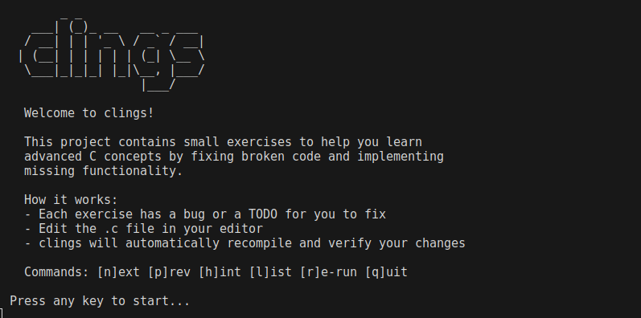
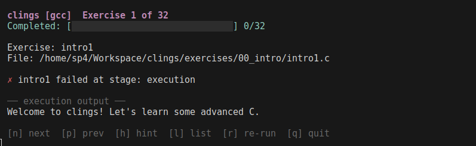

[](https://github.com/cdelmonte-zg/clings/actions/workflows/ci.yml)

```
       _ _
   ___| (_)_ __   __ _ ___
  / __| | | '_ \ / _` / __|
 | (__| | | | | | (_| \__ \
  \___|_|_|_| |_|\__, |___/
                  |___/
```

**Small exercises to learn advanced C concepts.**

Inspired by [rustlings](https://github.com/rust-lang/rustlings) --
fix broken C code, learn by doing.

The CLI is written in Rust for a fast, cross-platform experience;
the exercises are pure C11.

---

## Screenshots





*Edit a `.c` file -- save -- clings recompiles -- read the hint -- fix -- green.*

---

## Prerequisites

- **Rust toolchain** (`rustup` or system package)
- **gcc** and/or **clang** (C11 support required)

## Install

```bash
git clone https://github.com/cdelmonte-zg/clings.git
cd clings
cargo install --path .
```

## Quick start

```bash
clings
```

Each exercise has a bug or a `TODO` for you to fix.
Open the `.c` file in your editor, save your changes,
and clings will automatically recompile and verify.

### Interactive commands

| Key | Action                        |
|-----|-------------------------------|
| `n` | Next exercise                 |
| `p` | Previous exercise             |
| `h` | Show hint (additive)          |
| `l` | List all exercises            |
| `r` | Re-run current exercise       |
| `q` | Quit                          |

### CLI subcommands

```bash
clings run <name>            # run a specific exercise
clings hint <name> --level 2 # show first 2 hints
clings list                  # list exercises and progress
clings verify                # verify all exercises
clings reset                 # clear progress, start fresh
```

---

## How it works

1. clings reads `info.toml` to discover exercises and their metadata.
2. In watch mode it monitors the `exercises/` directory for file changes.
3. On each save it compiles the exercise with `gcc` (or `clang`),
   runs the binary, and optionally runs unit tests (`-DTEST`)
   and sanitizers (`-fsanitize=address,undefined`).
4. Results are shown immediately in the terminal.
5. Progress is saved to `.clings-state.txt` and persists across sessions.

---

## Exercises (32 total)

| Topic                 | #  | What you will learn                                 |
|-----------------------|----|-----------------------------------------------------|
| 00 Intro              | 1  | Getting started, basic program structure             |
| 01 Pointers           | 2  | Decay, arithmetic, pointer-size pitfalls             |
| 02 Memory             | 3  | `malloc`/`free`, `realloc`, leaks, double-free       |
| 03 Undefined Behavior | 1  | Signed overflow detection                            |
| 04 Preprocessor       | 1  | Stringify, token pasting, macro pitfalls             |
| 05 UB Lab             | 6  | Hands-on UB experiments with sanitizer feedback      |
| 06 Strings            | 3  | Safe concatenation, tokenizing, parsing              |
| 07 Structs            | 3  | Layout/padding, opaque types, linked lists           |
| 08 Function Pointers  | 3  | Callbacks, generic sort, dispatch tables             |
| 09 Const Correctness  | 3  | `const` parameters, pointer-to-const, immutable API  |
| 10 Error Handling     | 3  | Return codes, error propagation, error context       |
| 11 Bitwise            | 3  | Bit counting, packing/unpacking, bit tricks          |

---

## Features

- **Watch mode** -- recompiles on every save, shows errors instantly
- **gcc + clang** -- works with both compilers (`--compiler clang`)
- **Sanitizers** -- AddressSanitizer and UBSan catch hidden bugs
- **Progressive hints** -- press `h` repeatedly, hints accumulate
- **UB Lab** -- dedicated exercises where you trigger real undefined behavior
  and observe how sanitizers detect it

## Development

```bash
cargo test             # 24 unit + 8 integration tests
cargo clippy           # lint
cargo build --release  # optimized build
```

See [CONTRIBUTING.md](CONTRIBUTING.md) for how to add exercises.

## License

MIT
