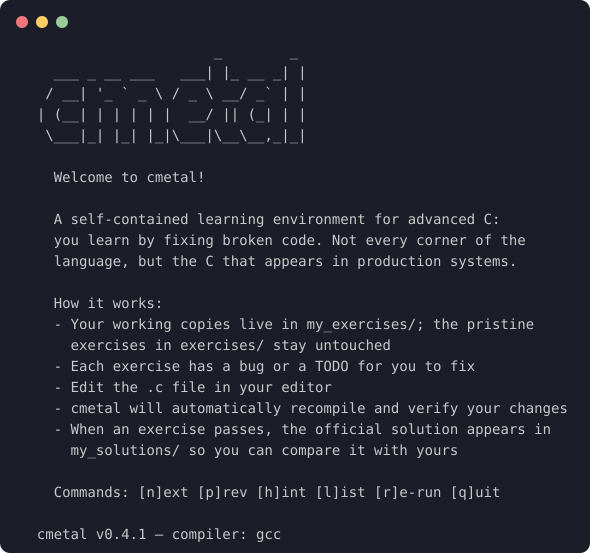
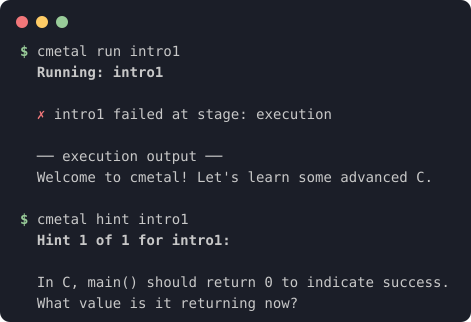

[](https://github.com/cdelmonte-zg/cmetal/actions/workflows/ci.yml)
[](https://cdelmonte-zg.github.io/cmetal/)
[](https://crates.io/crates/cmetal)

```
                     _        _ 
  ___ _ __ ___   ___| |_ __ _| |
 / __| '_ ` _ \ / _ \ __/ _` | |
| (__| | | | | |  __/ || (_| | |
 \___|_| |_| |_|\___|\__\__,_|_|
```

**Small exercises to learn advanced C concepts.** (formerly known as
*clings*)

Inspired by [rustlings](https://github.com/rust-lang/rustlings) --
fix broken C code, learn by doing.

Each exercise is a `.c` file with a real bug or a `TODO`. Open it, fix
it, and save: cmetal recompiles, runs the tests and sanitizers where
the exercise calls for them, and tells you in seconds whether you got
it right. 62 exercises across 20 topics,
from pointer decay and heap discipline through undefined behavior to an
implementation track -- encodings, tagged unions, hash tables, arenas,
a mark-sweep GC, NaN boxing, bytecode.

The CLI is written in Rust; the exercises are pure C11. cmetal
supports Linux and macOS. On Windows, use WSL: native toolchains lack
the sanitizers the exercises rely on.

📖 **[Documentation](https://cdelmonte-zg.github.io/cmetal/)** -- install
options, the watch-mode loop, the full curriculum, and how verification
works.

## Quick start

You need gcc or clang with C11 support. Then:

```bash
brew install cdelmonte-zg/tap/cmetal
# or, with a Rust toolchain: cargo install cmetal

cmetal init my-cmetal-course
cd my-cmetal-course
cmetal
```

The binary embeds the curriculum -- no clone needed. Work on the files
under `my_exercises/`, save, read the result; press `h` for progressive
hints. When an exercise passes, the official solution is revealed in
`my_solutions/` so you can compare it with yours. cmetal compiles with
gcc by default; run `cmetal --compiler clang` to use clang instead.

The other install routes (prebuilt binaries, build from source), plus
upgrade and uninstall, are covered in
[Install](https://cdelmonte-zg.github.io/cmetal/getting-started/install.html).

## Screenshots





*Edit a `.c` file -- save -- cmetal recompiles -- read the hint -- fix -- green.*

## Contributing

An exercise is a broken `.c` file, its solution, and hints in
`info.toml`. One invariant governs them -- every exercise fails as
shipped, every solution passes -- enforced by
`scripts/check_exercises.py` and CI. See
[CONTRIBUTING.md](CONTRIBUTING.md) for the walkthrough and
[VISION.md](VISION.md) for where the project is headed.

## License

MIT
